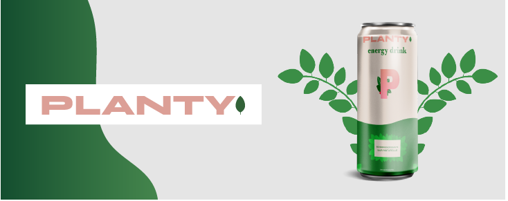
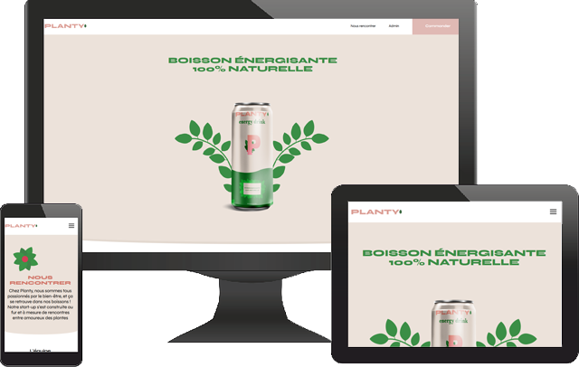

# Site vitrine PLANTY

## Projet 6 : Personnaliser un thème WordPress pour une stratup avec HTML, CSS et Php

### Objectif et ressources

Pour ce projet, je suis en charge de développer un site vitrine pour la société Planty (marque de boissons énergisantes à base de plantes).  
On me demande de développer le site sur WordPress et d’utiliser de préférence Gutenberg pour la gestion des pages.
Pour ce site il n'y aura que 4 pages : la page d'accueil, la page contact, la page commande et la page pour les mentions légales. Mais pour cette dernière page, il n'y a pas encore de texte, la page peut donc rester vide.

En ressource, on me donne :

<ul>
    <li><a href="https://www.figma.com/file/P19mvyz8EbozI4zlHJB7fy/Maquette-Planty-P6-Wordpress?node-id=0-1&t=iNwwNBiCNke2wMyD-0" target="_blank">la maquette Figma</a></li>
    <li><a href="https://www.figma.com/proto/P19mvyz8EbozI4zlHJB7fy/Maquette-Planty-P6-Wordpress?node-id=2%3A40&scaling=min-zoom&page-id=0%3A1&starting-point-node-id=2%3A40" target="_blank">un prototype sur Figma</a></li>
    <li><a href="https://course.oc-static.com/projects/D%C3%A9veloppeur+Web/DWP_P6+WordPress+PHP+Planty/DW+P6+Wordpress+-+Sp%C3%A9cifications+fonctionnelles.pdf" target="_blank">un guide avec les spécifications techniques</a></li>
</ul>
    
### Recommandations additionnelles
<ul>
    <li>Dans le header, il y doit y avoir un lien Admin qui pointe vers la gestion WordPress. Mais il ne doit être présent que si on est connecté. Il est donc conseillé d’utiliser un hook pour faire l’ajout de ce lien.</li>
    <li>Le site doit s’afficher correctement sur toutes les tailles d’écran (à partie de 320px).</li>
    <li>Les lignes écrites en HTML et CSS doivent passer au validateur du W3C.</li>
    <li>Le projet devra être versionné avec Git et GitHub.</li>
    <li>Les formulaires doivent être fonctionnels : un mail doit être envoyé à “planty.drinks@gmail.com”.</li>
    <li>Toutes les données (textes et images) doivent être modifiable sans utilisation de code.</li>
</ul>

### Les choix retenus

<ul>
    <li>Utilisation du thème <a href="https://fr.wordpress.org/themes/astra/" target="_blank">ASTRA</a>.</li>
    <li>Mise en place du plugin <a href="https://wordpress.org/plugins/fluentform/" target="_blank">Spectra</a> pour ajouter des blocs avancé à Gutemberg.</li>
    <li>Mise en place du plugin <a href="https://wordpress.org/plugins/fluentform/" target="_blank">Fluent Forms</a> pour la gestion des 2 formulaires.</li>
    <li>Mise en place du pluging <a href="https://fr.wordpress.org/plugins/all-in-one-wp-migration/" target="_blank">All-in One WP Migration</a> pour pouvoir faire une sauvegarde complète avec la base de données.</li>
    <li>Création d'un Hook avec 'wp_nav_menu_header-menu_items' pour l'ajout du lien Admin dans le Header.</li>
    <li>Création d'un Shortcodes pour créer une bordure infèrieure arrondie, avec une hauteur différente, sur certain block.</li>
</ul>

### Le site final

